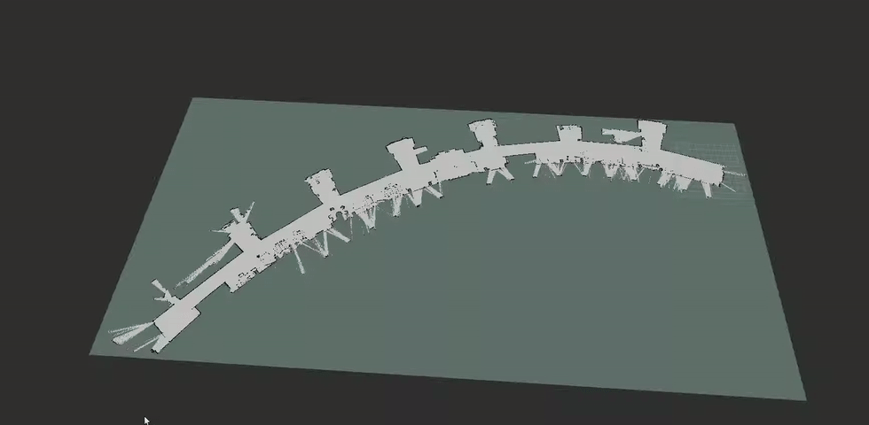
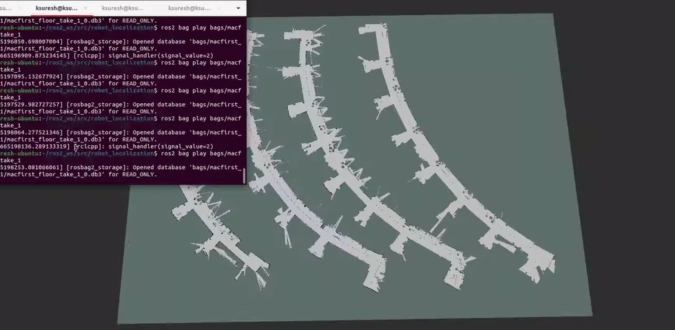

# Robot Localization Project
## What was the goal of your project?
The goal of this project was to localize the Turtlebot 4 within the 4 floors of the MAC. 
## How did you solve the problem? 
Initialize particles: Create a list of particles to represent possible robot locations centered around the current best estimate for where we think the robot is located.
Measure likelihoods: Use sensors such as the lidar to measure the environment of the robot and use this measurement to estimate the likelihoods of each particle. Then normalize the particle distribution to ensure the probability function of the robot location sums to 1.
Resample: Use the newly created particle distribution as an estimate for the Probability Density Function of the robot given the sensor measurements. Resample N particles from this PDF to shift the weighting of the current robot estimate. 
Apply odometry: Measure and apply the relative odometry translation to each of the particles in its own reference frame. If a particle runs into a wall or goes off the map, it can be removed and randomly re-added.  
Repeat Steps 2-4: Once we adjust each of the particle positions, we take a new sensor measurement and resample the distribution to eventually converge to maximum likelihood estimate of the robot.
Describe a design decision you had to make when working on your project and what you ultimately did (and why)? These design decisions could be particular choices for how you implemented some part of an algorithm or perhaps a decision regarding which of two external packages to use in your project.
One of the design decisions we made for our particle filter was implementing a particle decay. We chose to do this to allow the particles to localize faster on the individual floors. Without the decay, the particles would linger on other floors, making it difficult to locate the Turtlebot. This also progressively increases the speed of our algorithm and results in faster convergence. 
Another design decision we made was the implementation of our likelihood function. If the Neato’s scanned distance was within a certain threshold of an object, we would add 1 to the weight of the particle for each point. This simplified our code and allowed for optimized matrix calculations (logical indexing, matrix multiplication, vector sum).
## What if any challenges did you face along the way?
The main challenge we faced during this project was getting the Turtlebot 4 functional to create a scan of the 2nd, 3rd, and 4th floors of the MAC. We ran into several issues when working with the Turtlebot, but a difficult problem was trying to sync the clocks on our laptops and the Raspberry Pi on the Turtlebot. Because there is no RTC on the Raspberry Pi, the clock on it was inaccurate, making it difficult to create a scan with two different clock times. The eventual solution we reached was creating a NTP server on our laptop that the Raspberry Pi can connect to, to make sure that both computers were operating on the same time. 
## What would you do to improve your project if you had more time?
To improve the accuracy of our robot localization, we can implement ray casting and iterative closest points (ICP) to improve the accuracy of our particle filter. With ray casting, we would be able to simulate the scan for a specific particle and use this scan to generate a more robust likelihood by using a simplified ICP algorithm to match scans.
## Did you learn any interesting lessons for future robotic programming projects? These could relate to working on robotics projects in teams, working on more open-ended (and longer term) problems, or any other relevant topic.
An interesting lesson we learned during this project was the robustness of a particle filter. Even with very difficult scenarios the filter was able to discern the true robot location and adjust to any heuristics we used to adjust likelihood.
One lesson we learned during this project was setting aside more time for problems that we haven’t tackled before. The large time sink for this project was getting the Turtlebot up and running. Had we dedicated more time to researching how to solve specific issues with the Turtlebot before implementing it, we would have been on track to complete the project earlier and have more time to refine our particle filter.

